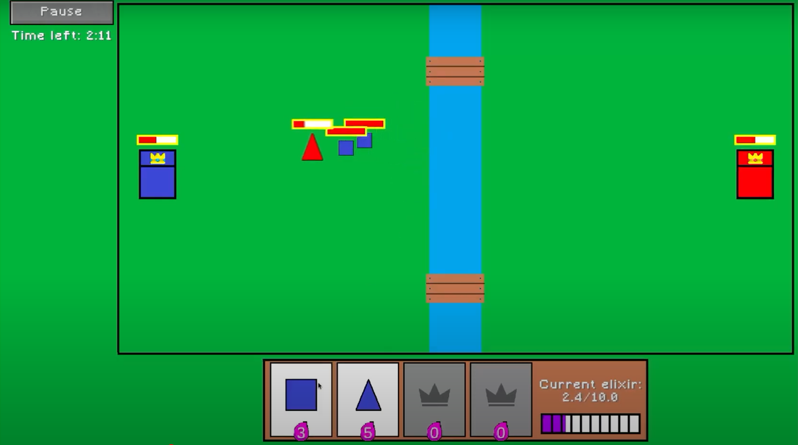

# 🕹️ Krolewskie Potyczki

Game-parody of Clash Royale, made by Artur Rubish, Roman Volochai and Pavlo Protsenko. 



## 🚀 How to Run the Game

### ✅ Requirements:

- Java 17 or higher  
  You can download it from [Adoptium](https://adoptium.net/) or [Oracle](https://www.oracle.com/java/technologies/javase-downloads.html)

### ▶️ Launch:

1. **Download the game**:  
   Go to the [GitHub repository](https://github.com/thrbbsh/krolewskie-potyczki) and click **"Download ZIP"** to get the project files.

2. **If you downloaded the ZIP archive**:
    - Extract the ZIP archive to any location.
    - Inside the extracted folder, double-click on `krolewskie_potyczki-1.0.0.jar` (Windows) or run the following in your terminal (Linux/macOS):

      ```bash
      java -jar krolewskie_potyczki-1.0.0.jar
      ```

3. **Enjoy the game!**
